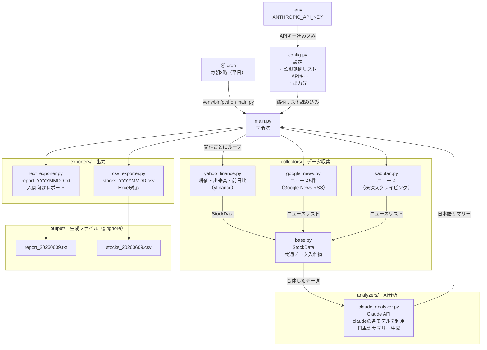

# stock-collector アーキテクチャ図

## 全体の処理フロー



## フォルダ構成と役割

| パス | 役割 |
|---|---|
| `main.py` | エントリーポイント。全体の処理を順番に呼び出す司令塔 |
| `config.py` | 監視銘柄・モデル名・出力先などの設定。銘柄追加はここだけ触る |
| `collectors/base.py` | `StockData` データクラスと `BaseCollector` 抽象クラスの定義 |
| `collectors/yahoo_finance.py` | yfinance で株価・出来高・前日比を取得 |
| `collectors/google_news.py` | Google News RSS から銘柄名で日本語ニュースを取得 |
| `collectors/kabutan.py` | 株探サイトをスクレイピングしてニュースを取得 |
| `analyzers/claude_analyzer.py` | Claude API に株価＋ニュースを投げて日本語サマリーを生成 |
| `exporters/text_exporter.py` | 人間向けテキストレポートを `output/` に保存 |
| `exporters/csv_exporter.py` | Excel 対応 CSV を `output/` に保存 |
| `notifiers/` | 将来のメール・LINE通知用（現在は未実装） |
| `output/` | 生成レポート置き場（gitignore対象） |
| `logs/` | 実行ログ置き場（gitignore対象） |

## 1回の実行で起きること

```
銘柄ごとに繰り返し（現在3社）
  1. Yahoo Finance → 株価・出来高・前日比 取得
  2. Google News + 株探 → ニュース取得・合体
  3. Claude API → 日本語サマリー生成

全銘柄完了後
  → output/report_YYYYMMDD.txt 保存
  → output/stocks_YYYYMMDD.csv 保存
```
